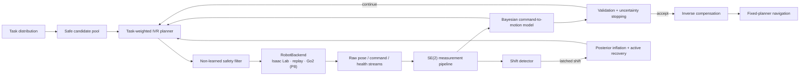

# CalibAgent

[English](README.md) | [简体中文](README_zh-CN.md)

[](https://github.com/EurekaZang/CalibAgent/actions/workflows/ci.yml)


**Safe, uncertainty-aware active velocity calibration for quadruped robots.**

CalibAgent is the research codebase for an ICRA-targeted study of how a
quadruped can select a small number of safe velocity commands, learn its
command-to-motion map, quantify epistemic uncertainty, and use the calibrated
model for navigation and post-shift recovery.

> **ICRA readiness: GO for the frozen P0–P7 claim set.**
> **Strong P6/P7 simulator readiness: GO.** The first strong P7 confirmation
> failed and remains part of the evidence record; the positive navigation
> claim rests only on the later disjoint replication. CalibAgent
> does **not** claim that P3–P7 have been executed online on a real Go2 or that
> sim-to-real robustness has been established.
> **Real-robot online active calibration remains P8.**

## Abstract

Velocity commands on a legged robot are not executed exactly: actuator
dynamics, learned locomotion policies, terrain, payload, and saturation create
a context-dependent mapping from commanded body velocity
`u = (vx, vy, wz)` to measured velocity `y`. CalibAgent treats this mismatch as
a sequential experimental-design problem. A Bayesian basis model estimates
the mapping and its predictive uncertainty; a task-weighted integrated
variance reduction planner chooses informative commands; non-learned safety
filters and validation-gated stopping constrain execution.

The frozen evidence spans synthetic studies, 183 passive Unitree Go2 trials,
fault injection, and pinned Isaac Lab/PhysX experiments. In the synthetic main
study, active calibration used 39.52% fewer trials than LHS to reach the joint
accuracy-and-uncertainty target. In strong simulator confirmation, active
recovery improved early post-shift error over passive updating across four
held-out shifts. A prospectively frozen navigation replication evaluated
3,024 episodes on six new maps: B8 achieved at least 70/72 successes per map,
zero collisions, and registered noninferiority to dense and matched-budget
controls. These findings are simulator-scoped unless explicitly identified as
real Go2 replay evidence.

## Research question

> Can a quadruped identify a task-relevant command-to-motion model with fewer
> safe trials than passive designs, while preserving calibrated uncertainty,
> bounded stopping behavior, adaptation after domain shift, and downstream
> navigation performance?

CalibAgent decomposes this question into a staged evidence program:

- **P0–P1:** define portable interfaces and validate passive calibration on
  real Go2/LiDAR-odometry data;
- **P2–P3:** test uncertainty calibration and task-aware active design under
  controlled synthetic mappings;
- **P4:** verify stopping and fail-closed safety independently of the learned
  model;
- **P5–P7:** evaluate the complete loop, shift recovery, and fixed-planner
  navigation in a pinned simulator;
- **P8:** conduct online real-Go2 confirmation under the frozen hardware
  protocol.

## Method



The numerical core imports neither Isaac Lab nor ROS 2. All environments
implement the same `RobotBackend`/`RawTrialData` contract, and the shared
measurement pipeline produces a `TrialObservation` before any model update.
This ports-and-adapters boundary separates algorithmic claims from simulator
or robot integration.

### Main components

1. **Uncertainty-aware model.** M2 is a Bayesian basis model with
   cross-axis, hinge, and interaction terms, a serializable posterior, and
   predictive epistemic variance.
2. **Task-aware acquisition.** The planner minimizes integrated posterior
   variance over a declared task-command distribution. Random, LHS, Sobol,
   Bayesian D-optimal, no-task, and dense controls are implemented under
   matched data-access rules.
3. **Independent safety layer.** A hard command/state envelope filters every
   candidate. The runtime state machine latches aborts and commands zero
   velocity without delegating safety to the learned model.
4. **Shift response.** Bounded evidence accumulation detects persistent
   changes, inflates stale posterior certainty, and allocates a fixed active
   recovery budget.
5. **Downstream evaluation.** Calibration methods are compared with identical
   waypoint planners, maps, policies, physics, seeds, and safety limits.

## Evidence and principal results

| Stage | Design and independent unit | Principal frozen result | Claim boundary |
|---|---|---|---|
| **P1 real replay** | 183 valid Go2 trials; three acquisition sessions; leave-one-session-out evaluation | M1 reduced pooled RMSE by **54.45% vs. raw** and **34.07% vs. M0** | Passive offline calibration on one robot/date/environment |
| **P2–P3 synthetic** | 20 independent seeds; three repeated distortion families; six acquisition controls | Active reached the joint target in 18.67 trials vs. 30.87 for LHS, a **39.52% reduction** (`p = 9.54e-7`) | Controlled synthetic mappings |
| **P4 safety/stopping** | 60 stopping trajectories, 300 hazards, 160 runtime faults | 0% premature stops; median/p95 excess trials 2/2; 100% hazard rejection; **0 serious events** | Replay and fault-injection evidence |
| **P5 closed loop** | Four Isaac Lab scenarios × 20 paired seeds; 12 active trials | Worst scenario RMSE reduction **9.30%**; all paired CI lower bounds positive; maximum abort response 20 ms | Pinned Isaac Lab/PhysX and official Go2 policies |
| **P6 strong shift** | Four held-out shifts × 72 paired seeds × frozen/passive/full | Passive-minus-full early RMSE CI lower bounds **0.00537–0.01536**; terminal RMSE CI upper ≤ 0.12564; **0 serious events** | Registered simulator shifts; no terminal superiority claim over passive |
| **P7 strong navigation** | Six new maps × 72 paired seeds × seven methods = **3,024 episodes** | Minimum B8 success **70/72**; collisions **0/72** on every map; worst dense/matched time-ratio CI upper **1.074/1.090** | Positive claim comes only from the disjoint replication |

The detailed evidence map is in
[`docs/requirements_matrix.md`](docs/requirements_matrix.md). Full numerical
results, estimands, intervals, and limitations are reported in
[`reports/`](reports/).

## Simulator results

### Isaac Sim experiment gallery — 29 evidence-distinct images

The gallery covers all 20 frozen P5–P7 simulator configurations without
repeating visually indistinguishable static scenes. P7 contributes 18 direct
1280×720 RGB frames for nine geometrically distinct maps. The 11 P5/P6
configurations each contribute one 1600×900 response card: two native Isaac
Sim frames replaying registered validation commands, the corresponding
simulated XY response traces, and the exact frozen physics, distortion, seed,
checkpoint, and endpoint values.

All simulator frames use Isaac Lab v2.3.2
(`37ddf626871758333d6ed89cf64ad702aef127d0`) and Isaac Sim
5.1.0-rc.19. P5/P6 cards are transparently labeled composites, not additional
quantitative evidence; their native source-frame hashes and response-trace
hashes are retained in the linked provenance.

In the P7 frames, cyan lines and spheres show the frozen planner path and
waypoints, and the green sphere marks the registered goal. These are
non-colliding, capture-only overlays derived from the versioned scenario
configuration; they do not alter an episode and are not quantitative
evidence.

In each P5/P6 response card, the two commands are the registered validation
commands at indices 2 and 7. Yellow marks the start, green marks the end of the
registered measurement window, and the colored line is replayed from the
actual simulated body-pose trace. The line geometry is non-colliding and used
only for visualization.

#### P7 disjoint strong-confirmatory replication — all six maps

<table>
  <tr>
    <th width="20%">Frozen map</th>
    <th width="40%">Course overview</th>
    <th width="40%">Robot view</th>
  </tr>
  <tr>
    <td><a href="docs/assets/readme/isaac_sim/p7_replicate_double_chicane_capture.json"><strong>Double chicane</strong></a><br>Two successive lateral reversals.</td>
    <td></td>
    <td></td>
  </tr>
  <tr>
    <td><a href="docs/assets/readme/isaac_sim/p7_replicate_extended_lane_capture.json"><strong>Extended lane</strong></a><br>Long-horizon tracking and stopping.</td>
    <td></td>
    <td></td>
  </tr>
  <tr>
    <td><a href="docs/assets/readme/isaac_sim/p7_replicate_narrow_lane_capture.json"><strong>Narrow lane</strong></a><br>Restricted lateral clearance.</td>
    <td></td>
    <td></td>
  </tr>
  <tr>
    <td><a href="docs/assets/readme/isaac_sim/p7_replicate_offset_slalom_capture.json"><strong>Offset slalom</strong></a><br>Alternating obstacle offsets.</td>
    <td></td>
    <td></td>
  </tr>
  <tr>
    <td><a href="docs/assets/readme/isaac_sim/p7_replicate_s_bend_capture.json"><strong>S-bend</strong></a><br>Continuous bidirectional curvature.</td>
    <td></td>
    <td></td>
  </tr>
  <tr>
    <td><a href="docs/assets/readme/isaac_sim/p7_replicate_weighted_arc_capture.json"><strong>Weighted arc</strong></a><br>Asymmetric curved tracking.</td>
    <td></td>
    <td></td>
  </tr>
</table>

#### P7 main navigation evaluation — three development maps

<table>
  <tr>
    <th width="20%">Frozen map</th>
    <th width="40%">Course overview</th>
    <th width="40%">Robot view</th>
  </tr>
  <tr>
    <td><a href="docs/assets/readme/isaac_sim/p7_main_narrow_corridor_capture.json"><strong>Narrow corridor</strong></a><br>Constrained corridor traversal.</td>
    <td></td>
    <td></td>
  </tr>
  <tr>
    <td><a href="docs/assets/readme/isaac_sim/p7_main_open_field_capture.json"><strong>Open field</strong></a><br>Unconstrained goal approach.</td>
    <td></td>
    <td></td>
  </tr>
  <tr>
    <td><a href="docs/assets/readme/isaac_sim/p7_main_slalom_capture.json"><strong>Slalom</strong></a><br>Three-obstacle alternating course.</td>
    <td></td>
    <td></td>
  </tr>
</table>

#### P5 closed-loop calibration — four registered scenes

<table>
  <tr>
    <th width="22%">Frozen scenario</th>
    <th width="78%">Registered response card</th>
  </tr>
  <tr>
    <td><a href="docs/assets/readme/isaac_sim/p5_tier_a_affine_capture.json"><strong>Tier-A affine</strong></a><br>Flat terrain and affine actuation distortion.</td>
    <td></td>
  </tr>
  <tr>
    <td><a href="docs/assets/readme/isaac_sim/p5_tier_a_deadzone_capture.json"><strong>Tier-A deadzone</strong></a><br>Flat terrain and command deadzone.</td>
    <td></td>
  </tr>
  <tr>
    <td><a href="docs/assets/readme/isaac_sim/p5_tier_b_friction_payload_capture.json"><strong>Tier-B friction + payload</strong></a><br>Low friction, +2.0 kg payload, +0.02 m COM shift.</td>
    <td></td>
  </tr>
  <tr>
    <td><a href="docs/assets/readme/isaac_sim/p5_tier_b_rough_capture.json"><strong>Tier-B rough</strong></a><br>Procedural rough terrain and shifted payload.</td>
    <td></td>
  </tr>
</table>

#### P6 main shift-recovery evaluation — three registered shifts

<table>
  <tr>
    <th width="22%">Post-shift scenario</th>
    <th width="78%">Registered response card</th>
  </tr>
  <tr>
    <td><a href="docs/assets/readme/isaac_sim/p6_main_friction_payload_gain_shift_capture.json"><strong>Friction + payload + gain</strong></a><br>Friction 0.90→0.25, +3.0 kg, +0.03 m COM.</td>
    <td></td>
  </tr>
  <tr>
    <td><a href="docs/assets/readme/isaac_sim/p6_main_gain_coupling_shift_capture.json"><strong>Gain recoupling</strong></a><br>Held physics with a registered actuation remapping.</td>
    <td></td>
  </tr>
  <tr>
    <td><a href="docs/assets/readme/isaac_sim/p6_main_mixed_context_shift_capture.json"><strong>Mixed context</strong></a><br>Friction 0.80→0.40, +2.0 kg, +0.02 m COM.</td>
    <td></td>
  </tr>
</table>

#### P6 strong-confirmatory recovery — four held-out shifts

<table>
  <tr>
    <th width="22%">Post-shift scenario</th>
    <th width="78%">Registered response card</th>
  </tr>
  <tr>
    <td><a href="docs/assets/readme/isaac_sim/p6_confirm_friction_payload_capture.json"><strong>Friction + payload</strong></a><br>Friction 0.92→0.28, +2.8 kg, +0.028 m COM.</td>
    <td></td>
  </tr>
  <tr>
    <td><a href="docs/assets/readme/isaac_sim/p6_confirm_gain_recoupling_capture.json"><strong>Gain recoupling</strong></a><br>Held friction and payload; held-out gain mapping.</td>
    <td></td>
  </tr>
  <tr>
    <td><a href="docs/assets/readme/isaac_sim/p6_confirm_mixed_context_capture.json"><strong>Mixed context</strong></a><br>Friction 0.80→0.42, +2.2 kg, −0.022 m COM.</td>
    <td></td>
  </tr>
  <tr>
    <td><a href="docs/assets/readme/isaac_sim/p6_confirm_payload_com_only_capture.json"><strong>Payload + COM only</strong></a><br>+3.0 kg and −0.032 m COM at held friction.</td>
    <td></td>
  </tr>
</table>

Each linked capture record stores the frozen scenario/configuration hash,
policy-checkpoint hash, selected seed, runtime identity, camera poses,
registered probe commands, distortion parameters, response-trace hashes,
overlay semantics, and PNG SHA-256 hashes. The reproducible implementations
are [`capture_readme_scene.py`](sim/isaaclab/scripts/capture_readme_scene.py)
and
[`build_isaac_response_card.py`](scripts/build_isaac_response_card.py).
Governance tests reject exact and near-duplicate gallery images. These assets
document the simulator setup and qualitative response; statistical claims
remain grounded in the versioned manifests, episode tables, and audit outputs.

### Sample efficiency and model uncertainty

<p align="center">
  
</p>

The task-weighted active method reaches the registered joint target earlier
than the passive designs. The right panel shows the corresponding reduction in
integrated epistemic variance. Inference uses the 20 independent seeds, not the
60 repeated seed-by-family conditions.

### Shift recovery and downstream navigation

<table>
  <tr>
    <td width="50%">
      
    </td>
    <td width="50%">
      
    </td>
  </tr>
  <tr>
    <td><strong>P6.</strong> Full active recovery improves the registered early
      window over passive updating and remains below the absolute terminal
      RMSE gate.</td>
    <td><strong>P7.</strong> The disjoint replication passes exact success and
      collision gates and paired completion-time noninferiority gates.</td>
  </tr>
</table>

The first strong P7 confirmation failed and remains in
[`evidence/p7_strong_confirmatory_failed/`](evidence/p7_strong_confirmatory_failed/).
The successful result uses new maps, new seeds, and a prospectively frozen
protocol; failed and development runs are not pooled into the positive
estimate.

<p align="center">
  
</p>

<p align="center">
  <em>Illustrative paired P7 episode (seed 8006), separate from the aggregate
  statistics. B0 raw control times out; B8 enters the goal region after 12
  calibration trials. The map, trajectories, and
  <a href="scripts/build_readme_figures.py">figure script</a> are versioned.</em>
</p>

## Publication-integrity design

- **Protocol isolation:** development and confirmation seeds are disjoint;
  task commands and held-out evaluation commands use separate fixed seeds.
- **Correct statistical unit:** paired simulator seed is the independent unit;
  repeated scenarios or maps are not treated as independent replicates.
- **Endpoint discipline:** downstream navigation endpoints cannot be rescued
  by a favorable calibration diagnostic.
- **Failure retention:** failed confirmation and corrective pilots remain
  versioned and are excluded from confirmatory estimates.
- **Executable audit:** publication checks recompute statistics and verify
  hashes, manifests, runtime locks, trace coverage, safety response, and Git
  ancestry without trusting a producer-written `GO` field.
- **Claim separation:** software CI, simulator readiness, real-data replay, and
  online hardware confirmation are distinct gates.

See the frozen
[`experiment protocol`](docs/experiment_protocol.md),
[`strong-confirmatory protocol`](docs/p6_p7_strong_confirmatory_protocol.md),
and
[`completion semantics`](docs/completion_semantics.md).

## Reproduce the audited package

### 1. Install

```bash
git clone https://github.com/EurekaZang/CalibAgent.git
cd CalibAgent
python -m venv .venv
.venv/bin/pip install \
  -r env/analysis/requirements.lock.txt \
  -r env/analysis/requirements-dev.lock.txt
.venv/bin/pip install --no-deps -e .
```

### 2. Run software and publication gates

```bash
PYTEST_DISABLE_PLUGIN_AUTOLOAD=1 \
  .venv/bin/pytest -p pytest_cov --cov=calibagent
.venv/bin/ruff check .
.venv/bin/mypy src/calibagent
.venv/bin/calibagent-audit --workspace . --require-ready
.venv/bin/calibagent-audit-strong --workspace . --require-ready
./scripts/audit_source_delivery.sh
```

With the 1.06 GB supplemental trajectory trees mounted:

```bash
.venv/bin/calibagent-audit-strong \
  --workspace . --raw --require-ready
```

### 3. Rebuild README figures

```bash
.venv/bin/python -m calibagent.cli.build_figures \
  --registry evidence/p3_main/trial_trace.csv \
  --output evidence/p3_main/sample_efficiency.png \
  --uncertainty-slice evidence/p3_main/uncertainty_slice.csv
.venv/bin/python scripts/build_readme_figures.py
```

P5–P7 reproduction additionally requires the pinned Isaac Lab v2.3.2/Isaac
Sim runtime and official Unitree Go2 policy checkpoints. Commands and runtime
locks are listed in
[`docs/experiment_registry.md`](docs/experiment_registry.md).
Native README scene frames are reproduced by
[`sim/isaaclab/scripts/capture_readme_scene.py`](sim/isaaclab/scripts/capture_readme_scene.py);
its required inputs and exact output hashes are preserved in the adjacent P5
and P7 capture records.

## Repository structure

| Path | Purpose |
|---|---|
| [`src/calibagent/core/`](src/calibagent/core/) | Bayesian models, active planners, stopping, safety, shift detection |
| [`src/calibagent/interfaces/`](src/calibagent/interfaces/) | Backend-independent data and execution contracts |
| [`src/calibagent/backends/`](src/calibagent/backends/) | Replay, Isaac Lab, and fail-closed Go2 adapters |
| [`src/calibagent/eval/`](src/calibagent/eval/) | Frozen benchmark and publication-audit implementations |
| [`configs/experiments/`](configs/experiments/) | Versioned development and confirmatory protocols |
| [`evidence/`](evidence/) | Compact, hash-bound evidence required by live audits |
| [`reports/`](reports/) | Phase reports, audit records, and publication figures |
| [`docs/`](docs/) | Architecture decisions, protocols, claim matrix, and hardware handoff |
| [`tests/`](tests/) | Unit, integration, regression, and governance tests |

## Real-robot P8

P1 provides real Go2 passive-replay evidence, but the online P8 boundary is
still open. `Go2RosBackend` intentionally fails closed until its ROS 2/Unitree
implementation, independent watchdog, P8-NAV/P8-SHIFT runners, and hardware
gates are complete.

Hardware collaborators should start with:

- the
  [Go2 implementation and simulator-code guide](docs/p8_go2_implementation_guide_zh.md);
- the
  [complete real-robot experiment and data handoff](docs/p8_go2_real_deployment_data_handoff_zh.md).

## Data and provenance

Regenerable outputs are gitignored. Frozen compact evidence is versioned under
`evidence/`; manifests bind artifacts to source commits, configurations,
runtime versions, policy hashes, and the supplemental full-resolution traces.
Dense-oracle evaluation points never fit the model, planner, or feature
scaling. See [`docs/experiment_protocol.md`](docs/experiment_protocol.md) for
the data-access rules.

## Citation

The manuscript citation will be added when the public preprint is released.
Until then, cite the repository version used in your work:

```bibtex
@software{calibagent_2026,
  author  = {{CalibAgent contributors}},
  title   = {CalibAgent: Safe and Uncertainty-Aware Active Velocity
             Calibration for Quadruped Robots},
  year    = {2026},
  version = {0.1.0},
  url     = {https://github.com/EurekaZang/CalibAgent}
}
```

## License

CalibAgent is released under the [MIT License](LICENSE).
