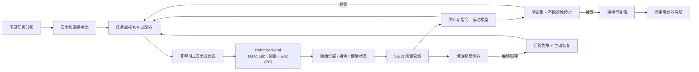

# CalibAgent

[English](README.md) | [简体中文](README_zh-CN.md)

[](https://github.com/EurekaZang/CalibAgent/actions/workflows/ci.yml)


**面向四足机器人的安全、不确定性感知主动速度标定。**

CalibAgent 是一项面向 ICRA 投稿研究的科研代码库。它研究四足机器人
如何在安全约束下主动选择少量速度指令，学习“指令到实际运动”的映射，
量化认知不确定性，并将标定模型用于导航与域偏移后的在线恢复。

> **发表边界：**可执行审计对冻结的 P0–P7 论文论点给出 `GO`。真实
> Unitree Go2 上的在线主动标定、导航和域偏移恢复仍属于 P8，当前仿真
> 结果不支持这些实机论点。

<p align="center">
  
</p>

<p align="center">
  <em>具有代表性的 P7 配对仿真 episode（seed 8006），不作为总体统计
  结果。B0 未标定控制超时；B8 使用 12 次标定试验后进入目标区域。
  地图、轨迹与<a href="scripts/build_readme_figures.py">绘图脚本</a>均已纳入版本控制。</em>
</p>

## 摘要

腿式机器人不会精确执行速度指令。执行器动态、学习式运动策略、地形、
载荷和饱和约束会共同形成从机体速度指令
`u = (vx, vy, wz)` 到实测速度 `y` 的上下文相关映射。CalibAgent 将这种
偏差建模为序贯实验设计问题：贝叶斯基函数模型估计映射和预测不确定性；
任务加权的积分方差缩减规划器选择信息量高的标定指令；非学习式安全过滤器
与验证门控的停止规则约束实际执行。

冻结证据覆盖合成实验、183 条 Unitree Go2 被动实机试验、故障注入和固定
Isaac Lab/PhysX 环境。在合成主实验中，主动标定达到联合精度与不确定性
目标所需试验数比 LHS 少 39.52%。在强确认性仿真中，主动恢复在四类留出
域偏移上降低了相对被动更新的早期误差。随后冻结的独立导航复现实验在
六张新地图上评估 3,024 个 episode：B8 在每张地图上至少成功 70/72 次、
碰撞为零，并满足相对 dense 与同预算基线的注册非劣效门槛。除明确标注的
真实 Go2 离线回放结果外，上述结论均限定在仿真范围内。

## 研究问题

> 四足机器人能否用少于被动采样的安全试验，识别与下游任务相关的
> 指令—运动映射，同时保持校准良好的不确定性、受控的停止行为、
> 域偏移后的恢复能力和下游导航性能？

CalibAgent 将这一问题拆分为分阶段证据链：

- **P0–P1：**冻结可移植接口，并用真实 Go2/LiDAR 里程计数据验证被动标定；
- **P2–P3：**在可控合成映射中检验不确定性校准与任务感知主动设计；
- **P4：**独立于学习模型验证停止规则和 fail-closed 安全逻辑；
- **P5–P7：**在固定仿真器中验证完整闭环、域偏移恢复和固定规划器导航；
- **P8：**按照冻结的实机协议完成在线 Go2 确认性实验。

## 方法



数值核心既不导入 Isaac Lab，也不导入 ROS 2。所有环境通过统一的
`RobotBackend`/`RawTrialData` 契约接入，共享测量管线在任何模型更新前
统一产生 `TrialObservation`。这一 ports-and-adapters 边界将算法论点与
仿真器或机器人集成清晰分离。

### 核心组成

1. **不确定性感知模型：**M2 贝叶斯基函数模型包含跨轴、hinge 与交互项，
   支持后验序列化和预测认知方差。
2. **任务感知采集：**规划器最小化声明任务指令分布上的积分后验方差。
   Random、LHS、Sobol、贝叶斯 D-optimal、no-task 和 dense 控制组遵守
   一致的数据访问规则。
3. **独立安全层：**硬指令/状态包络过滤所有候选；运行时状态机锁存
   abort 并输出零速度，安全责任不交给学习模型。
4. **域偏移响应：**有界证据累积检测持续变化，对已失效的后验置信度
   进行膨胀，并分配固定的主动恢复预算。
5. **下游评估：**不同标定方法使用完全相同的 waypoint 规划器、地图、
   运动策略、物理参数、随机种子和安全限制。

## 证据与主要结果

| 阶段 | 实验设计与独立统计单元 | 冻结的主要结果 | 论点边界 |
|---|---|---|---|
| **P1 真实回放** | 183 条有效 Go2 试验；三个采集 session；留一 session 交叉评估 | M1 的 pooled RMSE 相对 **raw 降低 54.45%**，相对 **M0 降低 34.07%** | 单机器人、单日期、单环境上的被动离线标定 |
| **P2–P3 合成实验** | 20 个独立 seed；三类重复失真条件；六个采集控制组 | Active 用 18.67 次试验达到联合目标，LHS 为 30.87 次，即 **减少 39.52%**（`p = 9.54e-7`） | 可控合成映射 |
| **P4 安全/停止** | 60 条停止轨迹、300 个危险注入、160 个运行时故障 | 提前停止率 0%；额外试验中位数/p95 为 2/2；危险拒绝率 100%；**严重事件 0** | 回放与故障注入证据 |
| **P5 仿真闭环** | 四类 Isaac Lab 场景 × 20 个配对 seed；12 次主动试验 | 最差场景 RMSE 降低 **9.30%**；全部配对 CI 下界为正；最大 abort 响应 20 ms | 固定 Isaac Lab/PhysX 与官方 Go2 策略 |
| **P6 强域偏移** | 四类留出偏移 × 72 个配对 seed × frozen/passive/full | Passive−full 早期 RMSE 的 CI 下界为 **0.00537–0.01536**；终端 RMSE CI 上界 ≤ 0.12564；**严重事件 0** | 注册仿真偏移；不主张终端优于 passive |
| **P7 强导航** | 六张新地图 × 72 个配对 seed × 七种方法 = **3,024 episodes** | B8 最低成功率 **70/72**；每张地图碰撞均为 **0/72**；相对 dense/同预算基线的最差时间比 CI 上界为 **1.074/1.090** | 正面结论仅来自独立复现实验 |

详细证据映射见
[`docs/requirements_matrix.md`](docs/requirements_matrix.md)，完整数值结果、
estimand、区间和局限性见 [`reports/`](reports/)。

## 仿真结果

### 样本效率与模型不确定性

<p align="center">
  
</p>

任务加权主动方法更早达到注册的联合目标；右图给出积分认知方差的同步
下降。统计推断使用 20 个独立 seed，而没有把 60 个重复的
seed×distortion-family 条件错误地视为独立样本。

### 域偏移恢复与下游导航

<table>
  <tr>
    <td width="50%">
      
    </td>
    <td width="50%">
      
    </td>
  </tr>
  <tr>
    <td><strong>P6：</strong>完整主动恢复在注册早期窗口中优于被动更新，
      同时满足绝对终端 RMSE 门槛。</td>
    <td><strong>P7：</strong>独立复现实验通过成功率、碰撞率精确区间门槛
      和配对完成时间非劣效门槛。</td>
  </tr>
</table>

第一次 P7 强确认实验失败，其证据继续保存在
[`evidence/p7_strong_confirmatory_failed/`](evidence/p7_strong_confirmatory_failed/)。
成功结果使用新的地图、新的 seed 和预先冻结的协议；失败实验与开发实验
没有被并入正面估计。

## 发表完整性设计

- **协议隔离：**开发与确认性 seed 不重叠；任务指令和留出评估指令使用
  不同的固定 seed。
- **正确统计单元：**配对仿真 seed 是独立单元，重复场景或地图不被当作
  独立重复。
- **终点纪律：**有利的标定诊断指标不能挽救失败的下游导航终点。
- **保留失败：**失败的确认实验与修复过程中使用的 pilot 均保留版本记录，
  且不进入确认性估计。
- **可执行审计：**发表审计重新计算统计量，并验证哈希、manifest、运行时
  锁、轨迹覆盖、安全响应和 Git ancestry，不信任生产端自行写入的 `GO`。
- **论点隔离：**软件 CI、仿真 readiness、真实数据回放和在线实机确认是
  不同的证据门槛。

参见冻结的
[`实验协议`](docs/experiment_protocol.md)、
[`强确认性实验协议`](docs/p6_p7_strong_confirmatory_protocol.md)和
[`完成语义`](docs/completion_semantics.md)。

## 复现已审计的软件包

### 1. 安装

```bash
git clone https://github.com/EurekaZang/CalibAgent.git
cd CalibAgent
python -m venv .venv
.venv/bin/pip install \
  -r env/analysis/requirements.lock.txt \
  -r env/analysis/requirements-dev.lock.txt
.venv/bin/pip install --no-deps -e .
```

### 2. 执行软件与发表门槛

```bash
PYTEST_DISABLE_PLUGIN_AUTOLOAD=1 \
  .venv/bin/pytest -p pytest_cov --cov=calibagent
.venv/bin/ruff check .
.venv/bin/mypy src/calibagent
.venv/bin/calibagent-audit --workspace . --require-ready
.venv/bin/calibagent-audit-strong --workspace . --require-ready
./scripts/audit_source_delivery.sh
```

挂载 1.06 GB 全分辨率补充轨迹后，可重复完整轨迹与哈希审计：

```bash
.venv/bin/calibagent-audit-strong \
  --workspace . --raw --require-ready
```

### 3. 重建 README 图片

```bash
.venv/bin/python -m calibagent.cli.build_figures \
  --registry evidence/p3_main/trial_trace.csv \
  --output evidence/p3_main/sample_efficiency.png \
  --uncertainty-slice evidence/p3_main/uncertainty_slice.csv
.venv/bin/python scripts/build_readme_figures.py
```

复现 P5–P7 还需要固定的 Isaac Lab v2.3.2/Isaac Sim 环境和官方 Unitree
Go2 策略 checkpoint。命令与运行时锁详见
[`docs/experiment_registry.md`](docs/experiment_registry.md)。

## 仓库结构

| 路径 | 用途 |
|---|---|
| [`src/calibagent/core/`](src/calibagent/core/) | 贝叶斯模型、主动规划器、停止、安全与域偏移检测 |
| [`src/calibagent/interfaces/`](src/calibagent/interfaces/) | 与 backend 无关的数据和执行契约 |
| [`src/calibagent/backends/`](src/calibagent/backends/) | 回放、Isaac Lab 与 fail-closed Go2 适配器 |
| [`src/calibagent/eval/`](src/calibagent/eval/) | 冻结 benchmark 与发表审计实现 |
| [`configs/experiments/`](configs/experiments/) | 版本化的开发和确认性实验协议 |
| [`evidence/`](evidence/) | 实时审计需要的紧凑、哈希绑定证据 |
| [`reports/`](reports/) | 阶段报告、审计记录和发表图表 |
| [`docs/`](docs/) | 架构决策、协议、论点矩阵与实机交接 |
| [`tests/`](tests/) | 单元、集成、回归和治理测试 |

## 真实机器人 P8

P1 已提供真实 Go2 被动回放证据，但在线 P8 边界尚未闭合。
`Go2RosBackend` 目前有意保持 fail-closed；只有完成 ROS 2/Unitree 接入、
独立 watchdog、P8-NAV/P8-SHIFT runner 和硬件门控后，才能开始正式采集。

实机同事应首先阅读：

- [Go2 实机软件实现与仿真代码导读](docs/p8_go2_implementation_guide_zh.md)；
- [完整实机实验、数据采集与交付规范](docs/p8_go2_real_deployment_data_handoff_zh.md)。

## 数据与溯源

可重新生成的输出默认被 gitignore。冻结的紧凑证据存储在 `evidence/`；
manifest 将每个产物绑定到源代码 commit、配置、运行时版本、策略哈希和
补充全分辨率轨迹。Dense-oracle 评估点不参与模型拟合、规划器调参或特征
缩放。完整数据访问规则见
[`docs/experiment_protocol.md`](docs/experiment_protocol.md)。

## 引用

公开预印本发布后将补充正式论文引用。在此之前，请引用实际使用的仓库版本：

```bibtex
@software{calibagent_2026,
  author  = {{CalibAgent contributors}},
  title   = {CalibAgent: Safe and Uncertainty-Aware Active Velocity
             Calibration for Quadruped Robots},
  year    = {2026},
  version = {0.1.0},
  url     = {https://github.com/EurekaZang/CalibAgent}
}
```

## 许可证

CalibAgent 使用 [MIT License](LICENSE)。
